# 基于STM32的平衡车代码思路

## 创建工程及引脚配置

- 配置下载模式：System core(系统中心)-SYS-Debug-Serial Wire(这就启动了下载程序的两个引脚)

- 配置时钟：RCC-HSE-Crystal/Ceramic Resonator(外部时钟)

- 配置时钟树：在Clock Configuration里把HCLK改成72赫兹，最后按两下回车

- 在project manager里记得要写项目名称并把IDE改成MDK-ARM，再在project manager左边的Code Generator里勾选上Generate peripheral initialization as a pair of '.c/.h' files per peripheral(生成.c和.h文件)

- 小扳手里第一个选项的Encoding可以修改语言格式

- 最好在魔术棒里把ARM Compiler改成版本6

- 魔术棒->Debug->Use:Setting->Flash Download->勾选Reset and Run

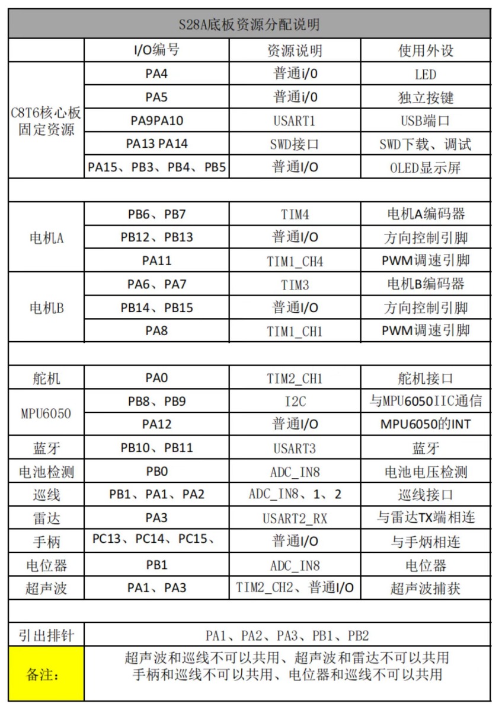

## OLED显示

- [ ] **PB5/PB4/PB3/PA15 设置成-->高电平输出、推挽输出、不上拉不下拉**

- [ ] **引脚名改名**<br>

PB5->OLED_SCLK	PB4->OLED_SDIN	PB3->OLED_RST	PA15->OLED_RS

- [ ] **创建Hardware文件夹，并在该文件夹下创建oled.c(Src文件夹)   oled.h（Inc文件夹）   oledfont.h（Inc文件夹）三个文件**

oled.c

```c
#include <oled.h>
#include "stdlib.h"
#include "oledfont.h"
#include "stdio.h"
#include "string.h"
#include "math.h"
u8 OLED_GRAM[128][8];

void OLED_Refresh_Gram(void)
{
	u8 i,n;
	for(i=0;i<8;i++)
	{
		OLED_WR_Byte (0xb0+i,OLED_CMD);    //设置页地址（0~7）
		OLED_WR_Byte (0x00,OLED_CMD);      //设置显示位置—列低地址
		OLED_WR_Byte (0x10,OLED_CMD);      //设置显示位置—列高地址
		for(n=0;n<128;n++)OLED_WR_Byte(OLED_GRAM[n][i],OLED_DATA);
	}
}

//向OLED写入一个字节。
//dat:要写入的数据/命令
//cmd:数据/命令标志 0,表示命令;1,表示数据;
void OLED_WR_Byte(u8 dat,u8 cmd)
{
	u8 i;
	if(cmd)
	  OLED_RS_Set();
	else
	  OLED_RS_Clr();
	for(i=0;i<8;i++)
	{
		OLED_SCLK_Clr();
		if(dat&0x80)
		   OLED_SDIN_Set();
		else
		   OLED_SDIN_Clr();
		OLED_SCLK_Set();
		dat<<=1;
	}
	OLED_RS_Set();
}


//开启OLED显示
void OLED_Display_On(void)
{
	OLED_WR_Byte(0X8D,OLED_CMD);  //SET DCDC命令
	OLED_WR_Byte(0X14,OLED_CMD);  //DCDC ON
	OLED_WR_Byte(0XAF,OLED_CMD);  //DISPLAY ON
}
//关闭OLED显示
void OLED_Display_Off(void)
{
	OLED_WR_Byte(0X8D,OLED_CMD);  //SET DCDC命令
	OLED_WR_Byte(0X10,OLED_CMD);  //DCDC OFF
	OLED_WR_Byte(0XAE,OLED_CMD);  //DISPLAY OFF
}
//清屏函数,清完屏,整个屏幕是黑色的!和没点亮一样!!!
void OLED_Clear(void)
{
	u8 i,n;
	for(i=0;i<8;i++)for(n=0;n<128;n++)OLED_GRAM[n][i]=0X00;
	OLED_Refresh_Gram();//更新显示
}
//画点
//x:0~127
//y:0~63
//t:1 填充 0,清空
void OLED_DrawPoint(u8 x,u8 y,u8 t)
{
	u8 pos,bx,temp=0;
	if(x>127||y>63)return;//超出范围了.
	pos=7-y/8;
	bx=y%8;
	temp=1<<(7-bx);
	if(t)OLED_GRAM[x][pos]|=temp;
	else OLED_GRAM[x][pos]&=~temp;
}

//在指定位置显示一个字符,包括部分字符
//x:0~127
//y:0~63
//mode:0,反白显示;1,正常显示
//size:选择字体 16/12
void OLED_ShowChar(u8 x,u8 y,u8 chr,u8 size,u8 mode)
{
	u8 temp,t,t1;
	u8 y0=y;
	chr=chr-' ';//得到偏移后的值
    for(t=0;t<size;t++)
    {
		if(size==12)temp=oled_asc2_1206[chr][t];  //调用1206字体
		else temp=oled_asc2_1608[chr][t];		 //调用1608字体
        for(t1=0;t1<8;t1++)
		{
			if(temp&0x80)OLED_DrawPoint(x,y,mode);
			else OLED_DrawPoint(x,y,!mode);
			temp<<=1;
			y++;
			if((y-y0)==size)
			{
				y=y0;
				x++;
				break;
			}
		}
    }
}

//m^n函数
u32 oled_pow(u8 m,u8 n)
{
	u32 result=1;
	while(n--)result*=m;
	return result;
}

//显示2个数字
//x,y :起点坐标
//len :数字的位数
//size:字体大小
//mode:模式	0,填充模式;1,叠加模式
//num:数值(0~4294967295);
void OLED_ShowNumber(u8 x,u8 y,u32 num,u8 len,u8 size)
{
	u8 t,temp;
	u8 enshow=0;
	for(t=0;t<len;t++)
	{
		temp=(num/oled_pow(10,len-t-1))%10;
		if(enshow==0&&t<(len-1))
		{
			if(temp==0)
			{
				OLED_ShowChar(x+(size/2)*t,y,' ',size,1);
				continue;
			}else enshow=1;

		}
	 	OLED_ShowChar(x+(size/2)*t,y,temp+'0',size,1);
	}
}

//显示字符串
//x,y:起点坐标
//*p:字符串起始地址
//用16字体
void OLED_ShowString(u8 x,u8 y,const u8 *p)
{
#define MAX_CHAR_POSX 122
#define MAX_CHAR_POSY 58
    while(*p!='\0')
    {
        if(x>MAX_CHAR_POSX){x=0;y+=16;}
        if(y>MAX_CHAR_POSY){y=x=0;OLED_Clear();}
        OLED_ShowChar(x,y,*p,12,1);
        x+=8;
        p++;
    }
}

//显示浮点数字
//x,y :起点坐标
//value :要显示的值
//decimalPlaces，小数点后位数，
// 显示浮点数函数
void OLED_ShowFloat(float value, uint8_t decimalPlaces, uint8_t x, uint8_t y) {
		
    char buffer[16];
    char tempBuffer[16]; // 用于存储没有符号的数字字符串
    int8_t is_negative = value < 0; // 用于标记数字是否为负数

    // 将浮点数转换为字符串格式，并指定小数位数
    snprintf(tempBuffer, sizeof(tempBuffer), "%.*f", decimalPlaces, fabs(value));

    // 如果数字是负数，添加负号
    if (is_negative) {
        snprintf(buffer, sizeof(buffer), "-%s", tempBuffer);
    } else {
        // 如果数字是正数，添加正号
        snprintf(buffer, sizeof(buffer), "+%s", tempBuffer);
    }

    // 在指定位置显示字符串
    for (uint8_t i = 0; buffer[i] != '\0'; i++) {
        OLED_ShowChar(x + i * 8, y, buffer[i], 16, 1);
    }
		
}


//显示带符号十进制数
void OLED_ShowSignedNum(uint8_t x, uint8_t y, int16_t num, u8 len, u8 size) {
    char buffer[12]; // 用于存储字符串表示的数字
    int str_len;
    uint8_t cur_x = x;
    int8_t is_negative = 0; // 用于标记数字是否为负数

    // 检查数字是否为负数
    if (num < 0) {
        is_negative = 1; // 标记为负数
        num = -num; // 转换为正数
    }
		
		

    // 将数字转换为字符串
    snprintf(buffer, sizeof(buffer), "%d", num);

    // 计算字符串长度
    str_len = strlen(buffer);

    // 如果字符串长度小于len，且数字是正数，则在前面补零
    if (str_len < len && !is_negative) {
        // 计算需要补多少个零
        int padding = len - str_len;
        // 在buffer前面补零
        memmove(buffer + padding, buffer, str_len + 1); // 移动字符串，为补零腾出空间
        memset(buffer, '0', padding); // 补零
    }
		// 如果字符串长度小于len，且数字是负数，则在前面补零
    if (str_len < len && is_negative) {
        // 计算需要补多少个零
        int padding = len - str_len;
        // 在buffer前面补零
        memmove(buffer + padding, buffer, str_len + 1); // 移动字符串，为补零腾出空间
        memset(buffer, '0', padding); // 补零
    }

    // 如果数字是负数，显示负号
    if (is_negative==1) {
        OLED_ShowChar(cur_x, y, '-', size, 1);
        cur_x += size / 2; // 调整位置
    }
		 
		// 如果数字是正数，显示正号
    else {
        OLED_ShowChar(cur_x, y, '+', size, 1);
        cur_x += size / 2; // 调整位置
    }

    // 显示每个数字
    for (int i = 0; buffer[i] != '\0' && len > 0; i++, len--) {
        OLED_ShowChar(cur_x, y, buffer[i], size, 1);
        cur_x += size / 2; // 调整位置
    }
}


//初始化OLED
void OLED_Init(void)
{
	OLED_RST_Clr();
	HAL_Delay(100);
	OLED_RST_Set();

	OLED_WR_Byte(0xAE,OLED_CMD); //关闭显示
	OLED_WR_Byte(0xD5,OLED_CMD); //设置时钟分频因子,震荡频率
	OLED_WR_Byte(80,OLED_CMD);   //[3:0],分频因子;[7:4],震荡频率
	OLED_WR_Byte(0xA8,OLED_CMD); //设置驱动路数
	OLED_WR_Byte(0X3F,OLED_CMD); //默认0X3F(1/64)
	OLED_WR_Byte(0xD3,OLED_CMD); //设置显示偏移
	OLED_WR_Byte(0X00,OLED_CMD); //默认为0

	OLED_WR_Byte(0x40,OLED_CMD); //设置显示开始行 [5:0],行数.

	OLED_WR_Byte(0x8D,OLED_CMD); //电荷泵设置
	OLED_WR_Byte(0x14,OLED_CMD); //bit2，开启/关闭
	OLED_WR_Byte(0x20,OLED_CMD); //设置内存地址模式
	OLED_WR_Byte(0x02,OLED_CMD); //[1:0],00，列地址模式;01，行地址模式;10,页地址模式;默认10;
	OLED_WR_Byte(0xA1,OLED_CMD); //段重定义设置,bit0:0,0->0;1,0->127;
	OLED_WR_Byte(0xC0,OLED_CMD); //设置COM扫描方向;bit3:0,普通模式;1,重定义模式 COM[N-1]->COM0;N:驱动路数
	OLED_WR_Byte(0xDA,OLED_CMD); //设置COM硬件引脚配置
	OLED_WR_Byte(0x12,OLED_CMD); //[5:4]配置

	OLED_WR_Byte(0x81,OLED_CMD); //对比度设置
	OLED_WR_Byte(0xEF,OLED_CMD); //1~255;默认0X7F (亮度设置,越大越亮)
	OLED_WR_Byte(0xD9,OLED_CMD); //设置预充电周期
	OLED_WR_Byte(0xf1,OLED_CMD); //[3:0],PHASE 1;[7:4],PHASE 2;
	OLED_WR_Byte(0xDB,OLED_CMD); //设置VCOMH 电压倍率
	OLED_WR_Byte(0x30,OLED_CMD); //[6:4] 000,0.65*vcc;001,0.77*vcc;011,0.83*vcc;

	OLED_WR_Byte(0xA4,OLED_CMD); //全局显示开启;bit0:1,开启;0,关闭;(白屏/黑屏)
	OLED_WR_Byte(0xA6,OLED_CMD); //设置显示方式;bit0:1,反相显示;0,正常显示
	OLED_WR_Byte(0xAF,OLED_CMD); //开启显示
	OLED_Clear();
}


//显示函数
void OLED_Show(void)
{
	OLED_Refresh_Gram();
	OLED_ShowFloat(2.567,2,0,0);
}

```

oled.h

```c
#ifndef OLED_H_
#define OLED_H_

#include "main.h"


#define u8 uint8_t
#define u16 uint16_t
#define u32 uint32_t
//-----------------OLED端口定义----------------
#define OLED_RST_Clr() HAL_GPIO_WritePin(OLED_RST_GPIO_Port, OLED_RST_Pin, GPIO_PIN_RESET)   //RST
#define OLED_RST_Set() HAL_GPIO_WritePin(OLED_RST_GPIO_Port, OLED_RST_Pin, GPIO_PIN_SET)   //RST

#define OLED_RS_Clr() HAL_GPIO_WritePin(OLED_RS_GPIO_Port, OLED_RS_Pin, GPIO_PIN_RESET)    //DC
#define OLED_RS_Set() HAL_GPIO_WritePin(OLED_RS_GPIO_Port, OLED_RS_Pin, GPIO_PIN_SET)    //DC

#define OLED_SCLK_Clr()  HAL_GPIO_WritePin(OLED_SCLK_GPIO_Port, OLED_SCLK_Pin, GPIO_PIN_RESET)  //SCL
#define OLED_SCLK_Set()  HAL_GPIO_WritePin(OLED_SCLK_GPIO_Port, OLED_SCLK_Pin, GPIO_PIN_SET)  //SCL

#define OLED_SDIN_Clr()  HAL_GPIO_WritePin(OLED_SDIN_GPIO_Port, OLED_SDIN_Pin, GPIO_PIN_RESET)   //SDA
#define OLED_SDIN_Set()  HAL_GPIO_WritePin(OLED_SDIN_GPIO_Port, OLED_SDIN_Pin, GPIO_PIN_SET)   //SDA

#define OLED_CMD  0	//写命令
#define OLED_DATA 1	//写数据
//OLED控制用函数
void OLED_WR_Byte(u8 dat,u8 cmd);
void OLED_Display_On(void);
void OLED_Display_Off(void);
void OLED_Refresh_Gram(void);
void OLED_Init(void);
void OLED_Clear(void);
void OLED_DrawPoint(u8 x,u8 y,u8 t);
void OLED_ShowChar(u8 x,u8 y,u8 chr,u8 size,u8 mode);
void OLED_ShowNumber(u8 x,u8 y,u32 num,u8 len,u8 size);
void OLED_ShowString(u8 x,u8 y,const u8 *p);
void OLED_ShowFloatNum(u8 x,u8 y,float num,u8 size1);
void OLED_ShowFloat(float value, uint8_t decimalPlaces, uint8_t x, uint8_t y);
void OLED_ShowFNum(u8 x,u8 y,float num,u8 len,u8 size,u8 mode);
void OLED_Show(void);
#endif /* OLED_H_ */


```

oledfont.h

```c
#ifndef OLEDFONT_H_
#define OLEDFONT_H_

//常用ASCII表
//偏移量32
//ASCII字符集
//偏移量32
//大小:12*6
const unsigned char oled_asc2_1206[95][12]={
    {0x00,0x00,0x00,0x00,0x00,0x00,0x00,0x00,0x00,0x00,0x00,0x00},/*" ",0*/
    {0x00,0x00,0x00,0x00,0x3F,0x40,0x00,0x00,0x00,0x00,0x00,0x00},/*"!",1*/
    {0x00,0x00,0x30,0x00,0x40,0x00,0x30,0x00,0x40,0x00,0x00,0x00},/*""",2*/
    {0x09,0x00,0x0B,0xC0,0x3D,0x00,0x0B,0xC0,0x3D,0x00,0x09,0x00},/*"#",3*/
    {0x18,0xC0,0x24,0x40,0x7F,0xE0,0x22,0x40,0x31,0x80,0x00,0x00},/*"$",4*/
    {0x18,0x00,0x24,0xC0,0x1B,0x00,0x0D,0x80,0x32,0x40,0x01,0x80},/*"%",5*/
    {0x03,0x80,0x1C,0x40,0x27,0x40,0x1C,0x80,0x07,0x40,0x00,0x40},/*"&",6*/
    {0x10,0x00,0x60,0x00,0x00,0x00,0x00,0x00,0x00,0x00,0x00,0x00},/*"'",7*/
    {0x00,0x00,0x00,0x00,0x00,0x00,0x1F,0x80,0x20,0x40,0x40,0x20},/*"(",8*/
    {0x00,0x00,0x40,0x20,0x20,0x40,0x1F,0x80,0x00,0x00,0x00,0x00},/*")",9*/
    {0x09,0x00,0x06,0x00,0x1F,0x80,0x06,0x00,0x09,0x00,0x00,0x00},/*"*",10*/
    {0x04,0x00,0x04,0x00,0x3F,0x80,0x04,0x00,0x04,0x00,0x00,0x00},/*"+",11*/
    {0x00,0x10,0x00,0x60,0x00,0x00,0x00,0x00,0x00,0x00,0x00,0x00},/*",",12*/
    {0x04,0x00,0x04,0x00,0x04,0x00,0x04,0x00,0x04,0x00,0x00,0x00},/*"-",13*/
    {0x00,0x00,0x00,0x40,0x00,0x00,0x00,0x00,0x00,0x00,0x00,0x00},/*".",14*/
    {0x00,0x20,0x01,0xC0,0x06,0x00,0x38,0x00,0x40,0x00,0x00,0x00},/*"/",15*/
    {0x1F,0x80,0x20,0x40,0x20,0x40,0x20,0x40,0x1F,0x80,0x00,0x00},/*"0",16*/
    {0x00,0x00,0x10,0x40,0x3F,0xC0,0x00,0x40,0x00,0x00,0x00,0x00},/*"1",17*/
    {0x18,0xC0,0x21,0x40,0x22,0x40,0x24,0x40,0x18,0x40,0x00,0x00},/*"2",18*/
    {0x10,0x80,0x20,0x40,0x24,0x40,0x24,0x40,0x1B,0x80,0x00,0x00},/*"3",19*/
    {0x02,0x00,0x0D,0x00,0x11,0x00,0x3F,0xC0,0x01,0x40,0x00,0x00},/*"4",20*/
    {0x3C,0x80,0x24,0x40,0x24,0x40,0x24,0x40,0x23,0x80,0x00,0x00},/*"5",21*/
    {0x1F,0x80,0x24,0x40,0x24,0x40,0x34,0x40,0x03,0x80,0x00,0x00},/*"6",22*/
    {0x30,0x00,0x20,0x00,0x27,0xC0,0x38,0x00,0x20,0x00,0x00,0x00},/*"7",23*/
    {0x1B,0x80,0x24,0x40,0x24,0x40,0x24,0x40,0x1B,0x80,0x00,0x00},/*"8",24*/
    {0x1C,0x00,0x22,0xC0,0x22,0x40,0x22,0x40,0x1F,0x80,0x00,0x00},/*"9",25*/
    {0x00,0x00,0x00,0x00,0x08,0x40,0x00,0x00,0x00,0x00,0x00,0x00},/*":",26*/
    {0x00,0x00,0x00,0x00,0x04,0x60,0x00,0x00,0x00,0x00,0x00,0x00},/*";",27*/
    {0x00,0x00,0x04,0x00,0x0A,0x00,0x11,0x00,0x20,0x80,0x40,0x40},/*"<",28*/
    {0x09,0x00,0x09,0x00,0x09,0x00,0x09,0x00,0x09,0x00,0x00,0x00},/*"=",29*/
    {0x00,0x00,0x40,0x40,0x20,0x80,0x11,0x00,0x0A,0x00,0x04,0x00},/*">",30*/
    {0x18,0x00,0x20,0x00,0x23,0x40,0x24,0x00,0x18,0x00,0x00,0x00},/*"?",31*/
    {0x1F,0x80,0x20,0x40,0x27,0x40,0x29,0x40,0x1F,0x40,0x00,0x00},/*"@",32*/
    {0x00,0x40,0x07,0xC0,0x39,0x00,0x0F,0x00,0x01,0xC0,0x00,0x40},/*"A",33*/
    {0x20,0x40,0x3F,0xC0,0x24,0x40,0x24,0x40,0x1B,0x80,0x00,0x00},/*"B",34*/
    {0x1F,0x80,0x20,0x40,0x20,0x40,0x20,0x40,0x30,0x80,0x00,0x00},/*"C",35*/
    {0x20,0x40,0x3F,0xC0,0x20,0x40,0x20,0x40,0x1F,0x80,0x00,0x00},/*"D",36*/
    {0x20,0x40,0x3F,0xC0,0x24,0x40,0x2E,0x40,0x30,0xC0,0x00,0x00},/*"E",37*/
    {0x20,0x40,0x3F,0xC0,0x24,0x40,0x2E,0x00,0x30,0x00,0x00,0x00},/*"F",38*/
    {0x0F,0x00,0x10,0x80,0x20,0x40,0x22,0x40,0x33,0x80,0x02,0x00},/*"G",39*/
    {0x20,0x40,0x3F,0xC0,0x04,0x00,0x04,0x00,0x3F,0xC0,0x20,0x40},/*"H",40*/
    {0x20,0x40,0x20,0x40,0x3F,0xC0,0x20,0x40,0x20,0x40,0x00,0x00},/*"I",41*/
    {0x00,0x60,0x20,0x20,0x20,0x20,0x3F,0xC0,0x20,0x00,0x20,0x00},/*"J",42*/
    {0x20,0x40,0x3F,0xC0,0x24,0x40,0x0B,0x00,0x30,0xC0,0x20,0x40},/*"K",43*/
    {0x20,0x40,0x3F,0xC0,0x20,0x40,0x00,0x40,0x00,0x40,0x00,0xC0},/*"L",44*/
    {0x3F,0xC0,0x3C,0x00,0x03,0xC0,0x3C,0x00,0x3F,0xC0,0x00,0x00},/*"M",45*/
    {0x20,0x40,0x3F,0xC0,0x0C,0x40,0x23,0x00,0x3F,0xC0,0x20,0x00},/*"N",46*/
    {0x1F,0x80,0x20,0x40,0x20,0x40,0x20,0x40,0x1F,0x80,0x00,0x00},/*"O",47*/
    {0x20,0x40,0x3F,0xC0,0x24,0x40,0x24,0x00,0x18,0x00,0x00,0x00},/*"P",48*/
    {0x1F,0x80,0x21,0x40,0x21,0x40,0x20,0xE0,0x1F,0xA0,0x00,0x00},/*"Q",49*/
    {0x20,0x40,0x3F,0xC0,0x24,0x40,0x26,0x00,0x19,0xC0,0x00,0x40},/*"R",50*/
    {0x18,0xC0,0x24,0x40,0x24,0x40,0x22,0x40,0x31,0x80,0x00,0x00},/*"S",51*/
    {0x30,0x00,0x20,0x40,0x3F,0xC0,0x20,0x40,0x30,0x00,0x00,0x00},/*"T",52*/
    {0x20,0x00,0x3F,0x80,0x00,0x40,0x00,0x40,0x3F,0x80,0x20,0x00},/*"U",53*/
    {0x20,0x00,0x3E,0x00,0x01,0xC0,0x07,0x00,0x38,0x00,0x20,0x00},/*"V",54*/
    {0x38,0x00,0x07,0xC0,0x3C,0x00,0x07,0xC0,0x38,0x00,0x00,0x00},/*"W",55*/
    {0x20,0x40,0x39,0xC0,0x06,0x00,0x39,0xC0,0x20,0x40,0x00,0x00},/*"X",56*/
    {0x20,0x00,0x38,0x40,0x07,0xC0,0x38,0x40,0x20,0x00,0x00,0x00},/*"Y",57*/
    {0x30,0x40,0x21,0xC0,0x26,0x40,0x38,0x40,0x20,0xC0,0x00,0x00},/*"Z",58*/
    {0x00,0x00,0x00,0x00,0x7F,0xE0,0x40,0x20,0x40,0x20,0x00,0x00},/*"[",59*/
    {0x00,0x00,0x70,0x00,0x0C,0x00,0x03,0x80,0x00,0x40,0x00,0x00},/*"\",60*/
    {0x00,0x00,0x40,0x20,0x40,0x20,0x7F,0xE0,0x00,0x00,0x00,0x00},/*"]",61*/
    {0x00,0x00,0x20,0x00,0x40,0x00,0x20,0x00,0x00,0x00,0x00,0x00},/*"^",62*/
    {0x00,0x10,0x00,0x10,0x00,0x10,0x00,0x10,0x00,0x10,0x00,0x10},/*"_",63*/
    {0x00,0x00,0x00,0x00,0x40,0x00,0x00,0x00,0x00,0x00,0x00,0x00},/*"`",64*/
    {0x00,0x00,0x02,0x80,0x05,0x40,0x05,0x40,0x03,0xC0,0x00,0x40},/*"a",65*/
    {0x20,0x00,0x3F,0xC0,0x04,0x40,0x04,0x40,0x03,0x80,0x00,0x00},/*"b",66*/
    {0x00,0x00,0x03,0x80,0x04,0x40,0x04,0x40,0x06,0x40,0x00,0x00},/*"c",67*/
    {0x00,0x00,0x03,0x80,0x04,0x40,0x24,0x40,0x3F,0xC0,0x00,0x40},/*"d",68*/
    {0x00,0x00,0x03,0x80,0x05,0x40,0x05,0x40,0x03,0x40,0x00,0x00},/*"e",69*/
    {0x00,0x00,0x04,0x40,0x1F,0xC0,0x24,0x40,0x24,0x40,0x20,0x00},/*"f",70*/
    {0x00,0x00,0x02,0xE0,0x05,0x50,0x05,0x50,0x06,0x50,0x04,0x20},/*"g",71*/
    {0x20,0x40,0x3F,0xC0,0x04,0x40,0x04,0x00,0x03,0xC0,0x00,0x40},/*"h",72*/
    {0x00,0x00,0x04,0x40,0x27,0xC0,0x00,0x40,0x00,0x00,0x00,0x00},/*"i",73*/
    {0x00,0x10,0x00,0x10,0x04,0x10,0x27,0xE0,0x00,0x00,0x00,0x00},/*"j",74*/
    {0x20,0x40,0x3F,0xC0,0x01,0x40,0x07,0x00,0x04,0xC0,0x04,0x40},/*"k",75*/
    {0x20,0x40,0x20,0x40,0x3F,0xC0,0x00,0x40,0x00,0x40,0x00,0x00},/*"l",76*/
    {0x07,0xC0,0x04,0x00,0x07,0xC0,0x04,0x00,0x03,0xC0,0x00,0x00},/*"m",77*/
    {0x04,0x40,0x07,0xC0,0x04,0x40,0x04,0x00,0x03,0xC0,0x00,0x40},/*"n",78*/
    {0x00,0x00,0x03,0x80,0x04,0x40,0x04,0x40,0x03,0x80,0x00,0x00},/*"o",79*/
    {0x04,0x10,0x07,0xF0,0x04,0x50,0x04,0x40,0x03,0x80,0x00,0x00},/*"p",80*/
    {0x00,0x00,0x03,0x80,0x04,0x40,0x04,0x50,0x07,0xF0,0x00,0x10},/*"q",81*/
    {0x04,0x40,0x07,0xC0,0x02,0x40,0x04,0x00,0x04,0x00,0x00,0x00},/*"r",82*/
    {0x00,0x00,0x06,0x40,0x05,0x40,0x05,0x40,0x04,0xC0,0x00,0x00},/*"s",83*/
    {0x00,0x00,0x04,0x00,0x1F,0x80,0x04,0x40,0x00,0x40,0x00,0x00},/*"t",84*/
    {0x04,0x00,0x07,0x80,0x00,0x40,0x04,0x40,0x07,0xC0,0x00,0x40},/*"u",85*/
    {0x04,0x00,0x07,0x00,0x04,0xC0,0x01,0x80,0x06,0x00,0x04,0x00},/*"v",86*/
    {0x06,0x00,0x01,0xC0,0x07,0x00,0x01,0xC0,0x06,0x00,0x00,0x00},/*"w",87*/
    {0x04,0x40,0x06,0xC0,0x01,0x00,0x06,0xC0,0x04,0x40,0x00,0x00},/*"x",88*/
    {0x04,0x10,0x07,0x10,0x04,0xE0,0x01,0x80,0x06,0x00,0x04,0x00},/*"y",89*/
    {0x00,0x00,0x04,0x40,0x05,0xC0,0x06,0x40,0x04,0x40,0x00,0x00},/*"z",90*/
    {0x00,0x00,0x00,0x00,0x04,0x00,0x7B,0xE0,0x40,0x20,0x00,0x00},/*"{",91*/
    {0x00,0x00,0x00,0x00,0x00,0x00,0xFF,0xF0,0x00,0x00,0x00,0x00},/*"|",92*/
    {0x00,0x00,0x40,0x20,0x7B,0xE0,0x04,0x00,0x00,0x00,0x00,0x00},/*"}",93*/
    {0x40,0x00,0x80,0x00,0x40,0x00,0x20,0x00,0x20,0x00,0x40,0x00},/*"~",94*/
};
const unsigned char oled_asc2_1608[95][16]={
    {0x00,0x00,0x00,0x00,0x00,0x00,0x00,0x00,0x00,0x00,0x00,0x00,0x00,0x00,0x00,0x00},/*" ",0*/
    {0x00,0x00,0x00,0x00,0x00,0x00,0x1F,0xCC,0x00,0x0C,0x00,0x00,0x00,0x00,0x00,0x00},/*"!",1*/
    {0x00,0x00,0x08,0x00,0x30,0x00,0x60,0x00,0x08,0x00,0x30,0x00,0x60,0x00,0x00,0x00},/*""",2*/
    {0x02,0x20,0x03,0xFC,0x1E,0x20,0x02,0x20,0x03,0xFC,0x1E,0x20,0x02,0x20,0x00,0x00},/*"#",3*/
    {0x00,0x00,0x0E,0x18,0x11,0x04,0x3F,0xFF,0x10,0x84,0x0C,0x78,0x00,0x00,0x00,0x00},/*"$",4*/
    {0x0F,0x00,0x10,0x84,0x0F,0x38,0x00,0xC0,0x07,0x78,0x18,0x84,0x00,0x78,0x00,0x00},/*"%",5*/
    {0x00,0x78,0x0F,0x84,0x10,0xC4,0x11,0x24,0x0E,0x98,0x00,0xE4,0x00,0x84,0x00,0x08},/*"&",6*/
    {0x08,0x00,0x68,0x00,0x70,0x00,0x00,0x00,0x00,0x00,0x00,0x00,0x00,0x00,0x00,0x00},/*"'",7*/
    {0x00,0x00,0x00,0x00,0x00,0x00,0x07,0xE0,0x18,0x18,0x20,0x04,0x40,0x02,0x00,0x00},/*"(",8*/
    {0x00,0x00,0x40,0x02,0x20,0x04,0x18,0x18,0x07,0xE0,0x00,0x00,0x00,0x00,0x00,0x00},/*")",9*/
    {0x02,0x40,0x02,0x40,0x01,0x80,0x0F,0xF0,0x01,0x80,0x02,0x40,0x02,0x40,0x00,0x00},/*"*",10*/
    {0x00,0x80,0x00,0x80,0x00,0x80,0x0F,0xF8,0x00,0x80,0x00,0x80,0x00,0x80,0x00,0x00},/*"+",11*/
    {0x00,0x01,0x00,0x0D,0x00,0x0E,0x00,0x00,0x00,0x00,0x00,0x00,0x00,0x00,0x00,0x00},/*",",12*/
    {0x00,0x00,0x00,0x80,0x00,0x80,0x00,0x80,0x00,0x80,0x00,0x80,0x00,0x80,0x00,0x80},/*"-",13*/
    {0x00,0x00,0x00,0x0C,0x00,0x0C,0x00,0x00,0x00,0x00,0x00,0x00,0x00,0x00,0x00,0x00},/*".",14*/
    {0x00,0x00,0x00,0x06,0x00,0x18,0x00,0x60,0x01,0x80,0x06,0x00,0x18,0x00,0x20,0x00},/*"/",15*/
    {0x00,0x00,0x07,0xF0,0x08,0x08,0x10,0x04,0x10,0x04,0x08,0x08,0x07,0xF0,0x00,0x00},/*"0",16*/
    {0x00,0x00,0x08,0x04,0x08,0x04,0x1F,0xFC,0x00,0x04,0x00,0x04,0x00,0x00,0x00,0x00},/*"1",17*/
    {0x00,0x00,0x0E,0x0C,0x10,0x14,0x10,0x24,0x10,0x44,0x11,0x84,0x0E,0x0C,0x00,0x00},/*"2",18*/
    {0x00,0x00,0x0C,0x18,0x10,0x04,0x11,0x04,0x11,0x04,0x12,0x88,0x0C,0x70,0x00,0x00},/*"3",19*/
    {0x00,0x00,0x00,0xE0,0x03,0x20,0x04,0x24,0x08,0x24,0x1F,0xFC,0x00,0x24,0x00,0x00},/*"4",20*/
    {0x00,0x00,0x1F,0x98,0x10,0x84,0x11,0x04,0x11,0x04,0x10,0x88,0x10,0x70,0x00,0x00},/*"5",21*/
    {0x00,0x00,0x07,0xF0,0x08,0x88,0x11,0x04,0x11,0x04,0x18,0x88,0x00,0x70,0x00,0x00},/*"6",22*/
    {0x00,0x00,0x1C,0x00,0x10,0x00,0x10,0xFC,0x13,0x00,0x1C,0x00,0x10,0x00,0x00,0x00},/*"7",23*/
    {0x00,0x00,0x0E,0x38,0x11,0x44,0x10,0x84,0x10,0x84,0x11,0x44,0x0E,0x38,0x00,0x00},/*"8",24*/
    {0x00,0x00,0x07,0x00,0x08,0x8C,0x10,0x44,0x10,0x44,0x08,0x88,0x07,0xF0,0x00,0x00},/*"9",25*/
    {0x00,0x00,0x00,0x00,0x00,0x00,0x03,0x0C,0x03,0x0C,0x00,0x00,0x00,0x00,0x00,0x00},/*":",26*/
    {0x00,0x00,0x00,0x00,0x00,0x01,0x01,0x06,0x00,0x00,0x00,0x00,0x00,0x00,0x00,0x00},/*";",27*/
    {0x00,0x00,0x00,0x80,0x01,0x40,0x02,0x20,0x04,0x10,0x08,0x08,0x10,0x04,0x00,0x00},/*"<",28*/
    {0x02,0x20,0x02,0x20,0x02,0x20,0x02,0x20,0x02,0x20,0x02,0x20,0x02,0x20,0x00,0x00},/*"=",29*/
    {0x00,0x00,0x10,0x04,0x08,0x08,0x04,0x10,0x02,0x20,0x01,0x40,0x00,0x80,0x00,0x00},/*">",30*/
    {0x00,0x00,0x0E,0x00,0x12,0x00,0x10,0x0C,0x10,0x6C,0x10,0x80,0x0F,0x00,0x00,0x00},/*"?",31*/
    {0x03,0xE0,0x0C,0x18,0x13,0xE4,0x14,0x24,0x17,0xC4,0x08,0x28,0x07,0xD0,0x00,0x00},/*"@",32*/
    {0x00,0x04,0x00,0x3C,0x03,0xC4,0x1C,0x40,0x07,0x40,0x00,0xE4,0x00,0x1C,0x00,0x04},/*"A",33*/
    {0x10,0x04,0x1F,0xFC,0x11,0x04,0x11,0x04,0x11,0x04,0x0E,0x88,0x00,0x70,0x00,0x00},/*"B",34*/
    {0x03,0xE0,0x0C,0x18,0x10,0x04,0x10,0x04,0x10,0x04,0x10,0x08,0x1C,0x10,0x00,0x00},/*"C",35*/
    {0x10,0x04,0x1F,0xFC,0x10,0x04,0x10,0x04,0x10,0x04,0x08,0x08,0x07,0xF0,0x00,0x00},/*"D",36*/
    {0x10,0x04,0x1F,0xFC,0x11,0x04,0x11,0x04,0x17,0xC4,0x10,0x04,0x08,0x18,0x00,0x00},/*"E",37*/
    {0x10,0x04,0x1F,0xFC,0x11,0x04,0x11,0x00,0x17,0xC0,0x10,0x00,0x08,0x00,0x00,0x00},/*"F",38*/
    {0x03,0xE0,0x0C,0x18,0x10,0x04,0x10,0x04,0x10,0x44,0x1C,0x78,0x00,0x40,0x00,0x00},/*"G",39*/
    {0x10,0x04,0x1F,0xFC,0x10,0x84,0x00,0x80,0x00,0x80,0x10,0x84,0x1F,0xFC,0x10,0x04},/*"H",40*/
    {0x00,0x00,0x10,0x04,0x10,0x04,0x1F,0xFC,0x10,0x04,0x10,0x04,0x00,0x00,0x00,0x00},/*"I",41*/
    {0x00,0x03,0x00,0x01,0x10,0x01,0x10,0x01,0x1F,0xFE,0x10,0x00,0x10,0x00,0x00,0x00},/*"J",42*/
    {0x10,0x04,0x1F,0xFC,0x11,0x04,0x03,0x80,0x14,0x64,0x18,0x1C,0x10,0x04,0x00,0x00},/*"K",43*/
    {0x10,0x04,0x1F,0xFC,0x10,0x04,0x00,0x04,0x00,0x04,0x00,0x04,0x00,0x0C,0x00,0x00},/*"L",44*/
    {0x10,0x04,0x1F,0xFC,0x1F,0x00,0x00,0xFC,0x1F,0x00,0x1F,0xFC,0x10,0x04,0x00,0x00},/*"M",45*/
    {0x10,0x04,0x1F,0xFC,0x0C,0x04,0x03,0x00,0x00,0xE0,0x10,0x18,0x1F,0xFC,0x10,0x00},/*"N",46*/
    {0x07,0xF0,0x08,0x08,0x10,0x04,0x10,0x04,0x10,0x04,0x08,0x08,0x07,0xF0,0x00,0x00},/*"O",47*/
    {0x10,0x04,0x1F,0xFC,0x10,0x84,0x10,0x80,0x10,0x80,0x10,0x80,0x0F,0x00,0x00,0x00},/*"P",48*/
    {0x07,0xF0,0x08,0x18,0x10,0x24,0x10,0x24,0x10,0x1C,0x08,0x0A,0x07,0xF2,0x00,0x00},/*"Q",49*/
    {0x10,0x04,0x1F,0xFC,0x11,0x04,0x11,0x00,0x11,0xC0,0x11,0x30,0x0E,0x0C,0x00,0x04},/*"R",50*/
    {0x00,0x00,0x0E,0x1C,0x11,0x04,0x10,0x84,0x10,0x84,0x10,0x44,0x1C,0x38,0x00,0x00},/*"S",51*/
    {0x18,0x00,0x10,0x00,0x10,0x04,0x1F,0xFC,0x10,0x04,0x10,0x00,0x18,0x00,0x00,0x00},/*"T",52*/
    {0x10,0x00,0x1F,0xF8,0x10,0x04,0x00,0x04,0x00,0x04,0x10,0x04,0x1F,0xF8,0x10,0x00},/*"U",53*/
    {0x10,0x00,0x1E,0x00,0x11,0xE0,0x00,0x1C,0x00,0x70,0x13,0x80,0x1C,0x00,0x10,0x00},/*"V",54*/
    {0x1F,0xC0,0x10,0x3C,0x00,0xE0,0x1F,0x00,0x00,0xE0,0x10,0x3C,0x1F,0xC0,0x00,0x00},/*"W",55*/
    {0x10,0x04,0x18,0x0C,0x16,0x34,0x01,0xC0,0x01,0xC0,0x16,0x34,0x18,0x0C,0x10,0x04},/*"X",56*/
    {0x10,0x00,0x1C,0x00,0x13,0x04,0x00,0xFC,0x13,0x04,0x1C,0x00,0x10,0x00,0x00,0x00},/*"Y",57*/
    {0x08,0x04,0x10,0x1C,0x10,0x64,0x10,0x84,0x13,0x04,0x1C,0x04,0x10,0x18,0x00,0x00},/*"Z",58*/
    {0x00,0x00,0x00,0x00,0x00,0x00,0x7F,0xFE,0x40,0x02,0x40,0x02,0x40,0x02,0x00,0x00},/*"[",59*/
    {0x00,0x00,0x30,0x00,0x0C,0x00,0x03,0x80,0x00,0x60,0x00,0x1C,0x00,0x03,0x00,0x00},/*"\",60*/
    {0x00,0x00,0x40,0x02,0x40,0x02,0x40,0x02,0x7F,0xFE,0x00,0x00,0x00,0x00,0x00,0x00},/*"]",61*/
    {0x00,0x00,0x00,0x00,0x20,0x00,0x40,0x00,0x40,0x00,0x40,0x00,0x20,0x00,0x00,0x00},/*"^",62*/
    {0x00,0x01,0x00,0x01,0x00,0x01,0x00,0x01,0x00,0x01,0x00,0x01,0x00,0x01,0x00,0x01},/*"_",63*/
    {0x00,0x00,0x40,0x00,0x40,0x00,0x20,0x00,0x00,0x00,0x00,0x00,0x00,0x00,0x00,0x00},/*"`",64*/
    {0x00,0x00,0x00,0x98,0x01,0x24,0x01,0x44,0x01,0x44,0x01,0x44,0x00,0xFC,0x00,0x04},/*"a",65*/
    {0x10,0x00,0x1F,0xFC,0x00,0x88,0x01,0x04,0x01,0x04,0x00,0x88,0x00,0x70,0x00,0x00},/*"b",66*/
    {0x00,0x00,0x00,0x70,0x00,0x88,0x01,0x04,0x01,0x04,0x01,0x04,0x00,0x88,0x00,0x00},/*"c",67*/
    {0x00,0x00,0x00,0x70,0x00,0x88,0x01,0x04,0x01,0x04,0x11,0x08,0x1F,0xFC,0x00,0x04},/*"d",68*/
    {0x00,0x00,0x00,0xF8,0x01,0x44,0x01,0x44,0x01,0x44,0x01,0x44,0x00,0xC8,0x00,0x00},/*"e",69*/
    {0x00,0x00,0x01,0x04,0x01,0x04,0x0F,0xFC,0x11,0x04,0x11,0x04,0x11,0x00,0x18,0x00},/*"f",70*/
    {0x00,0x00,0x00,0xD6,0x01,0x29,0x01,0x29,0x01,0x29,0x01,0xC9,0x01,0x06,0x00,0x00},/*"g",71*/
    {0x10,0x04,0x1F,0xFC,0x00,0x84,0x01,0x00,0x01,0x00,0x01,0x04,0x00,0xFC,0x00,0x04},/*"h",72*/
    {0x00,0x00,0x01,0x04,0x19,0x04,0x19,0xFC,0x00,0x04,0x00,0x04,0x00,0x00,0x00,0x00},/*"i",73*/
    {0x00,0x00,0x00,0x03,0x00,0x01,0x01,0x01,0x19,0x01,0x19,0xFE,0x00,0x00,0x00,0x00},/*"j",74*/
    {0x10,0x04,0x1F,0xFC,0x00,0x24,0x00,0x40,0x01,0xB4,0x01,0x0C,0x01,0x04,0x00,0x00},/*"k",75*/
    {0x00,0x00,0x10,0x04,0x10,0x04,0x1F,0xFC,0x00,0x04,0x00,0x04,0x00,0x00,0x00,0x00},/*"l",76*/
    {0x01,0x04,0x01,0xFC,0x01,0x04,0x01,0x00,0x01,0xFC,0x01,0x04,0x01,0x00,0x00,0xFC},/*"m",77*/
    {0x01,0x04,0x01,0xFC,0x00,0x84,0x01,0x00,0x01,0x00,0x01,0x04,0x00,0xFC,0x00,0x04},/*"n",78*/
    {0x00,0x00,0x00,0xF8,0x01,0x04,0x01,0x04,0x01,0x04,0x01,0x04,0x00,0xF8,0x00,0x00},/*"o",79*/
    {0x01,0x01,0x01,0xFF,0x00,0x85,0x01,0x04,0x01,0x04,0x00,0x88,0x00,0x70,0x00,0x00},/*"p",80*/
    {0x00,0x00,0x00,0x70,0x00,0x88,0x01,0x04,0x01,0x04,0x01,0x05,0x01,0xFF,0x00,0x01},/*"q",81*/
    {0x01,0x04,0x01,0x04,0x01,0xFC,0x00,0x84,0x01,0x04,0x01,0x00,0x01,0x80,0x00,0x00},/*"r",82*/
    {0x00,0x00,0x00,0xCC,0x01,0x24,0x01,0x24,0x01,0x24,0x01,0x24,0x01,0x98,0x00,0x00},/*"s",83*/
    {0x00,0x00,0x01,0x00,0x01,0x00,0x07,0xF8,0x01,0x04,0x01,0x04,0x00,0x00,0x00,0x00},/*"t",84*/
    {0x01,0x00,0x01,0xF8,0x00,0x04,0x00,0x04,0x00,0x04,0x01,0x08,0x01,0xFC,0x00,0x04},/*"u",85*/
    {0x01,0x00,0x01,0x80,0x01,0x70,0x00,0x0C,0x00,0x10,0x01,0x60,0x01,0x80,0x01,0x00},/*"v",86*/
    {0x01,0xF0,0x01,0x0C,0x00,0x30,0x01,0xC0,0x00,0x30,0x01,0x0C,0x01,0xF0,0x01,0x00},/*"w",87*/
    {0x00,0x00,0x01,0x04,0x01,0x8C,0x00,0x74,0x01,0x70,0x01,0x8C,0x01,0x04,0x00,0x00},/*"x",88*/
    {0x01,0x01,0x01,0x81,0x01,0x71,0x00,0x0E,0x00,0x18,0x01,0x60,0x01,0x80,0x01,0x00},/*"y",89*/
    {0x00,0x00,0x01,0x84,0x01,0x0C,0x01,0x34,0x01,0x44,0x01,0x84,0x01,0x0C,0x00,0x00},/*"z",90*/
    {0x00,0x00,0x00,0x00,0x00,0x00,0x00,0x00,0x01,0x00,0x3E,0xFC,0x40,0x02,0x40,0x02},/*"{",91*/
    {0x00,0x00,0x00,0x00,0x00,0x00,0x00,0x00,0xFF,0xFF,0x00,0x00,0x00,0x00,0x00,0x00},/*"|",92*/
    {0x00,0x00,0x40,0x02,0x40,0x02,0x3E,0xFC,0x01,0x00,0x00,0x00,0x00,0x00,0x00,0x00},/*"}",93*/
    {0x00,0x00,0x60,0x00,0x80,0x00,0x80,0x00,0x40,0x00,0x40,0x00,0x20,0x00,0x20,0x00},/*"~",94*/
};

#endif /* OLEDFONT_H_ */


```

- [ ] **在main.c中加入相应头文件**

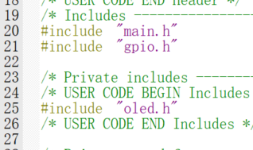

```c
#include "oled.h"
```


- [ ] **在main.c文件的while函数前写上三个OLED初始化函数，只需要修改oled.c中的OLED_Show函数中的内容并在main.c的while函数中引用即可**

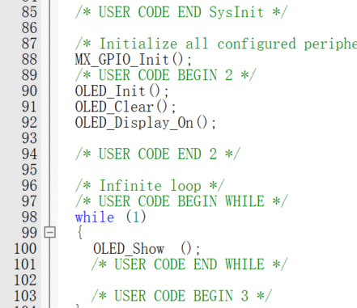

```c
 OLED_Init();
 OLED_Clear();
 OLED_Display_On();
```

```c
OLED_Show();
```

## MPU6050 DMP姿态解算

- [ ] **配置PB8,PB9引脚**   这里使用的是IIC通信，直接打开I2C1

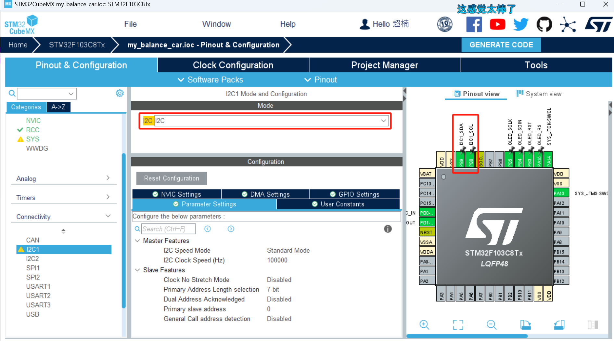

- [ ] **直接引用网上开源的姿态解算文件**   分别对应放在Src和Inc文件夹里

[MPU6050姿态解算网盘文件](https://pan.baidu.com/s/1qnHxhsSgNqLzeHjKUbNtKg)提取码: tp36 

- [ ] **在main.c和oled.c里面**

```c
#include "MPU6050.h"
```

- [ ] **修改OLED_Show()函数进行测试**

```c
//显示函数
void OLED_Show(void)
{
    OLED_Refresh_Gram();

    float pitch,roll,yaw;
    int16_t AX, AY, AZ, GX, GY, GZ;
    MPU6050_DMP_Get_Data( &pitch, &roll, &yaw, &GX, &GY, &GZ, &AX, &AY, &AZ);
    OLED_ShowFloat(pitch,2,0,0);//绕x轴旋转角度,将小车正对自己，向前是x轴，左右是y轴,上下是z轴
    OLED_ShowFloat(roll,2,0,15);//绕y轴旋转角度
    OLED_ShowFloat(yaw,2,0,31);	//绕z轴旋转角度
}
```

*(这里会报错，只需要修改inv_mpu.c为如图所示即可)*

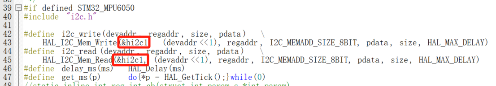

注意！*(这最终获得的是相对于初始姿态的相对倾角)*

## 配置PWM控制电机转速

- [ ] **计算公式**

- PWM频率：Freq = CK_PSC/(PSC+1)/(ARR+1)
- PWM占空比：Duty = CCR/(ARR+1)
- PWM分辨率：Reso = 1/(ARR+1)

*STM32内部时钟（CK_PSC）为72MHz*

- [ ] **开启TIM1的内部时钟	PSC = 3-1	ARR = 1000-1**<br>可得频率 = 24000Hz    (*得让频率在20~20000Hz之外，这样电机没有电流声*)<BR>*（CCR暂时不用初始化，STM32Hal库中有现成函数可以直接调用）*

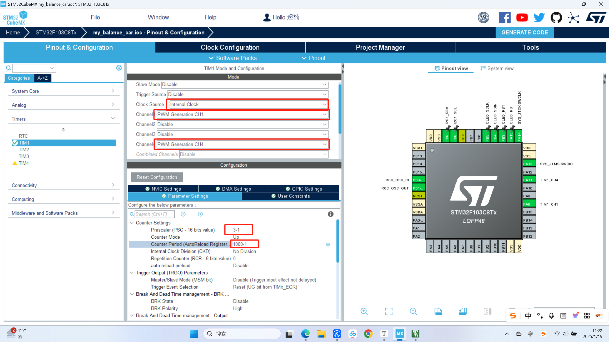

- [ ] **使用推挽输出配置AIN1、AIN2、BIN1、BIN2**

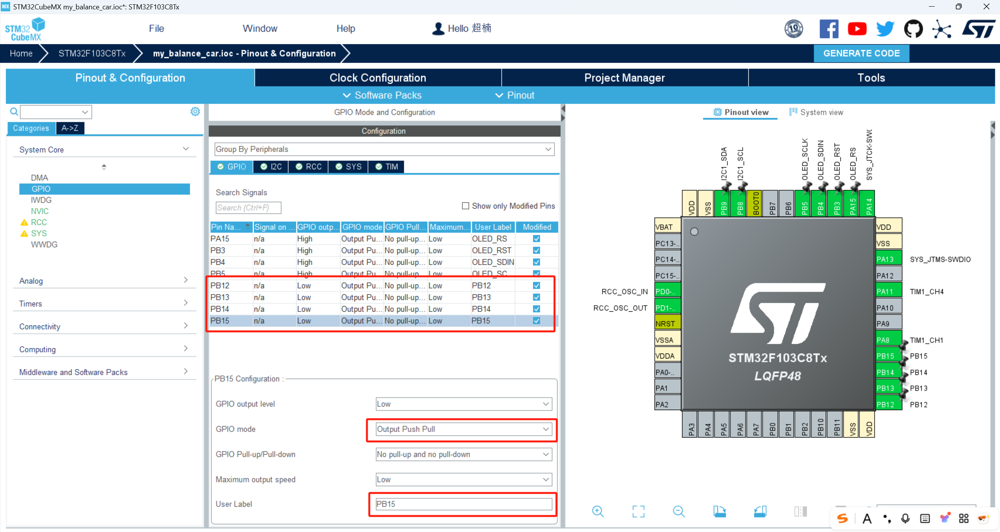

- [ ] **编写电机控制函数**

- 新建Motor_Control.c和Motor_Control.h文件

Motor_Control.c

```c
#include "Motor_Control.h"
#include "tim.h"


void Motor_Control_Init(void)//初始化两个轮子的PWM通道
{
		HAL_TIM_PWM_Start (&htim1 ,TIM_CHANNEL_1 );//左轮
	  HAL_TIM_PWM_Start (&htim1 ,TIM_CHANNEL_4 );//右轮
}

void SetPWMleft(int pwm)
{
	if(pwm>=0)//pwm>=0 (AIN1,AIN2)=(0, 1) 正转 顺时针
	{
		HAL_GPIO_WritePin (GPIOB,PB15_Pin ,GPIO_PIN_RESET); //AIN1=0
		HAL_GPIO_WritePin (GPIOB,PB14_Pin ,GPIO_PIN_SET); //AIN2=1
		__HAL_TIM_SET_COMPARE (&htim1 ,TIM_CHANNEL_1 ,pwm);//pwm=0~1000
	}
	else if(pwm<0)//pwm<0 (AIN1, AIN2)=(1, 0) 反转 逆时针
	{
		HAL_GPIO_WritePin (GPIOB,PB15_Pin ,GPIO_PIN_SET); //AIN1=1
		HAL_GPIO_WritePin (GPIOB,PB14_Pin ,GPIO_PIN_RESET); //AIN2=0
		__HAL_TIM_SET_COMPARE (&htim1 ,TIM_CHANNEL_1 ,-pwm);//pwm=-1000~0
	}
}


void SetPWMright(int pwm)
{
	if(pwm>=0)//pwm>=0 (BIN1,BIN2)=(0, 1) 正转 顺时针
	{
		HAL_GPIO_WritePin (GPIOB,PB12_Pin ,GPIO_PIN_RESET); //BIN1=0
		HAL_GPIO_WritePin (GPIOB,PB13_Pin ,GPIO_PIN_SET); //BIN2=1
		__HAL_TIM_SET_COMPARE (&htim1 ,TIM_CHANNEL_4,pwm);//pwm=0~1000
	}
	else if(pwm<0)//pwm<0 (BIN1, BIN2)=(1, 0) 反转 逆时针
	{
		HAL_GPIO_WritePin (GPIOB,PB12_Pin ,GPIO_PIN_SET); //BIN1=1
		HAL_GPIO_WritePin (GPIOB,PB13_Pin ,GPIO_PIN_RESET); //BIN2=0
		__HAL_TIM_SET_COMPARE (&htim1 ,TIM_CHANNEL_4,-pwm);//pwm=-1000~0
	}
}

```

Motor_Control.h

```c
#ifndef __Moter_Control_H
#define __Moter_Control_H
#include "main.h"

void Motor_Control_Init(void);
void SetPWMleft(int pwm);
void SetPWMright(int pwm);


#endif //定义完毕，或者引用过头文件到达这一步


```

- 在main.c函数中加上头文件

```c
#include "Motor_Control.h"
```

- 在main.c里调用轮子的初始化函数（里面包括PWM通道的初始化）

```c
Motor_Control_Init();
```

*（然后可以在while中调用“SetPWMleft(200)”进行测试）*

## 配置编码器测速

- [ ] **开启TIM3和TIM4的编码器模式，并把相应引脚设置为上拉模式（防止误触发），并开启中断（优先级高）**

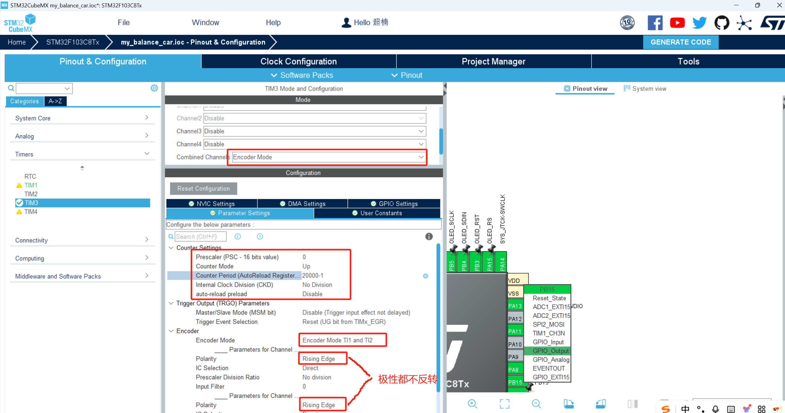

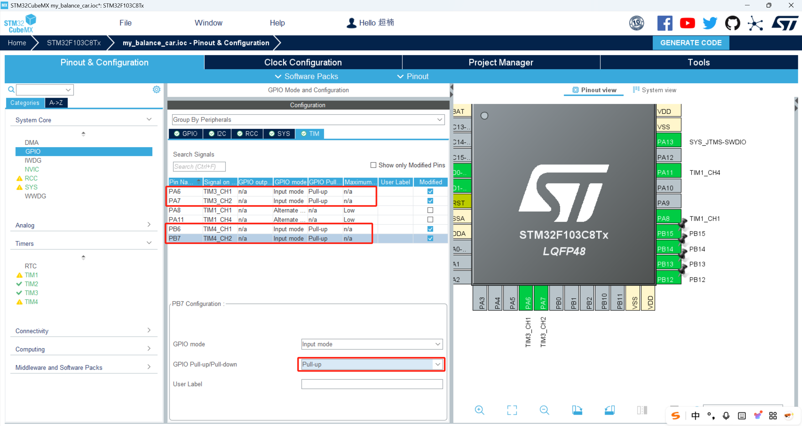


- [ ] **开启TIM2定时器中断用来实时计算速度并开启中断（优先级低）**

*如下图设置后，频率 = 50Hz，20ms进一次中断测一次速度*

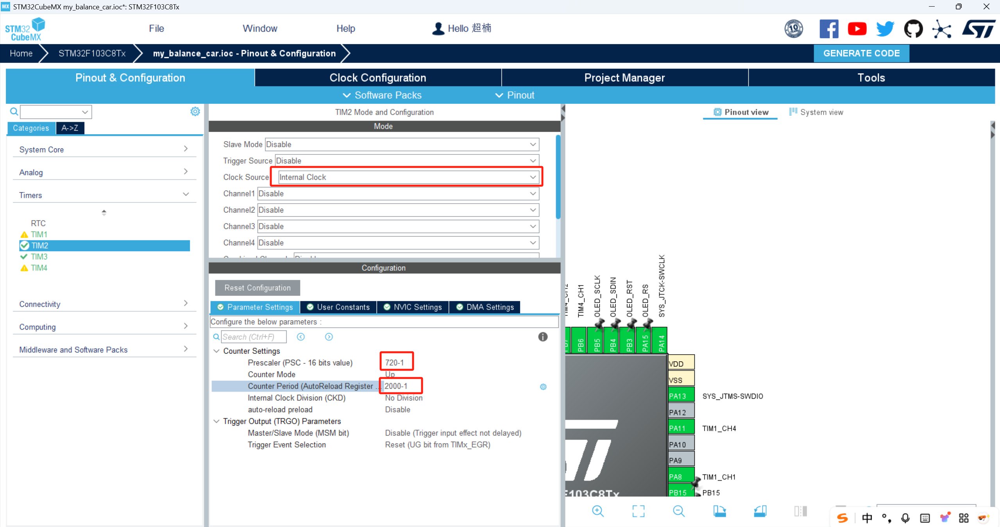

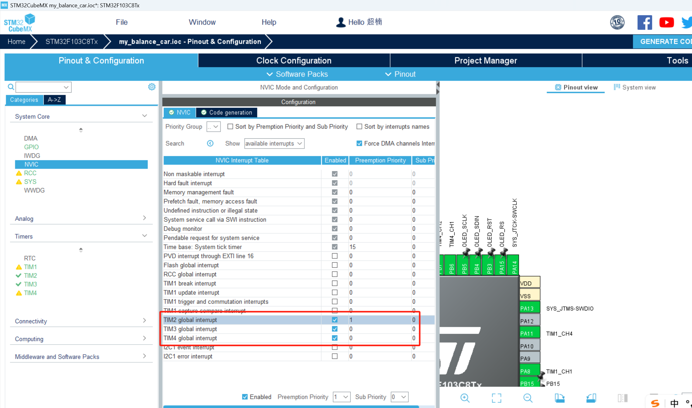

- [ ] **创建encoder.c和encoder.h文件并编写代码**

- M法测速：n = $\frac{M}{CT}$

*（测量时间为T，T时间内的脉冲数为M，C为电机转一圈产生的脉冲数）*

encoder.h

```c
#ifndef __encoder_H
#define __encoder_H
#include "main.h"

#define MOTOR_SPEED_RERATIO 30    	//电机减速比
#define PULSE_PRE_ROUND 13 			//一圈多少个脉冲
#define RADIUS_OF_TYRE 34 			//轮胎半径，单位毫米
#define LINE_SPEED_C RADIUS_OF_TYRE * 2 * 3.14				 //轮胎周长
#define Get_ARR_Left __HAL_TIM_GetAutoreload(&htim3)   		 //获取自动装载值,本例中为20000
#define Get_ARR_Right __HAL_TIM_GetAutoreload(&htim4)
#define Get_Encoder_Left __HAL_TIM_GetCounter(&htim3)        //获取编码器定时器中的计数值
#define Get_Encoder_Right __HAL_TIM_GetCounter(&htim4)


typedef struct 
{
    int32_t lastCount;   //上一次计数值
    int32_t totalCount;  //总计数值
    int16_t overflowNum; //溢出次数
    float speed;         //电机转速
    uint8_t direct;      //旋转方向
}Motor_Left;


typedef struct 
{
    int32_t lastCount;   //上一次计数值
    int32_t totalCount;  //总计数值
    int16_t overflowNum; //溢出次数
    float speed;         //电机转速
    uint8_t direct;      //旋转方向
}Motor_Right;


void Encoder_Init(void);

#endif


```

encoder.c

```c
#include "encoder.h"
#include "tim.h"
#include "Motor_Control.h"


Motor_Left motorleft;				//引用encoder.h中定义的结构体
Motor_Right motorright;				//引用encoder.h中定义的结构体
float speed_left;

void Encoder_Init(void)
{
    HAL_TIM_Encoder_Start(&htim3 , TIM_CHANNEL_ALL);     //开启编码器定时器3（左轮）
    HAL_TIM_Encoder_Start(&htim4 , TIM_CHANNEL_ALL);	 //开启编码器定时器4（右轮）
    __HAL_TIM_ENABLE_IT(&htim3,TIM_IT_UPDATE);           //开启编码器定时器3更新中断,防溢出处理
    __HAL_TIM_ENABLE_IT(&htim4,TIM_IT_UPDATE);           //开启编码器定时器4更新中断,防溢出处理

    HAL_TIM_Base_Start_IT(&htim2);                       //开启20ms定时器中断
    HAL_TIM_PWM_Start(&htim1, TIM_CHANNEL_1);            //开启PWM1（左轮）
    HAL_TIM_PWM_Start(&htim1, TIM_CHANNEL_4);            //开启PWM4（右轮）

    __HAL_TIM_SET_COUNTER(&htim3, 10000);                //编码器3定时器初始值设定为10000
    __HAL_TIM_SET_COUNTER(&htim4, 10000);                //编码器4定时器初始值设定为10000

    motorleft.lastCount = 0;                             //上一次计数值
    motorleft.totalCount = 0;							 //总计数值
    motorleft.overflowNum = 0;                           //溢出次数      
    motorleft.speed = 0;    							 //电机转速
    motorleft.direct = 0;								 //旋转方向

    motorright.lastCount = 0;                          
    motorright.totalCount = 0;
    motorright.overflowNum = 0;                                  
    motorright.speed = 0;
    motorright.direct = 0;
}


void HAL_TIM_PeriodElapsedCallback(TIM_HandleTypeDef *htim)//定时器回调函数，用于计算速度
{	
    if(htim->Instance==htim2.Instance)//间隔定时器中断，是时候计算速度了
    {

        /******************************计算左轮速度********************************/
        motorleft.direct = __HAL_TIM_IS_TIM_COUNTING_DOWN(&htim3);//判断左轮方向，如果向上计数（正转），返回值为0，否则返回值为1
        motorleft.totalCount = Get_Encoder_Left + motorleft.overflowNum * Get_ARR_Left;//一个周期内的总计数值等于目前计数值加上溢出的计数值

        if(motorleft.lastCount - motorleft.totalCount > 19000) // 在计数值溢出时进行防溢出处理
        {
            motorleft.overflowNum++;
            motorleft.totalCount = Get_Encoder_Left + motorleft.overflowNum * Get_ARR_Left;//一个周期内的总计数值等于目前计数值加上溢出的计数值
        }
        else if(motorleft.totalCount - motorleft.lastCount > 19000) // 在计数值溢出时进行防溢出处理
        {
            motorleft.overflowNum--;
            motorleft.totalCount = Get_Encoder_Left + motorleft.overflowNum * Get_ARR_Left;//一个周期内的总计数值等于目前计数值加上溢出的计数值
        }
        motorleft.speed = (float)(motorleft.totalCount - motorleft.lastCount) / (4 * MOTOR_SPEED_RERATIO * PULSE_PRE_ROUND) * 50;//算得每秒多少转,除以4是因为4倍频
        motorleft.lastCount = motorleft.totalCount; //记录这一次的计数值


        /******************************计算右轮速度********************************/
        motorright.direct = __HAL_TIM_IS_TIM_COUNTING_DOWN(&htim4);//如果向上计数（正转），返回值为0，否则返回值为1
        motorright.totalCount = Get_Encoder_Right + motorright.overflowNum * Get_ARR_Right;//一个周期内的总计数值等于目前计数值加上溢出的计数值

        if(motorright.lastCount - motorright.totalCount > 19000) // 在计数值溢出时进行防溢出处理
        {
            motorright.overflowNum++;
            motorright.totalCount = Get_Encoder_Right + motorright.overflowNum * Get_ARR_Right;//一个周期内的总计数值等于目前计数值加上溢出的计数值
        }
        else if(motorright.totalCount - motorright.lastCount > 19000) // 在计数值溢出时进行防溢出处理
        {
            motorright.overflowNum--;
            motorright.totalCount = Get_Encoder_Right + motorright.overflowNum * Get_ARR_Right;//一个周期内的总计数值等于目前计数值加上溢出的计数值
        }
        motorright.speed = (float)(motorright.totalCount - motorright.lastCount) / (4 * MOTOR_SPEED_RERATIO * PULSE_PRE_ROUND) * 50;//算得每秒多少转,除以4是因为4倍频
        motorright.lastCount = motorright.totalCount; //记录这一次的计数值

    }
}


```

- 在main.c中加上头文件

```c
#include "encoder.h"
```

- 在main.c中调用编码器初始化函数

```c
Encoder_Init();
```

- 测试：

1. 在main.c的while循环里调用

```c
SetPWMleft(500);
SetPWMright(500);
```

2. 在oled.c中引用头文件

```c
#include "encoder.h"
```

3. 在oled.c中引用有关速度参数的结构体

```c
extern Motor_Left motorleft;				//引用encoder.h中定义的结构体
extern Motor_Right motorright;				//引用encoder.h中定义的结构体
```

4. 修改OLED_Show（）函数

```c
//显示函数
void OLED_Show(void)
{
    OLED_Refresh_Gram();
	
    OLED_ShowFloat(motorleft.speed,2,0,0);
		OLED_ShowFloat(motorright.speed,2,0,15);
}
```

- [ ] **添加滤波函数**

*（我直接给你修改后的encoder.c的代码吧，其实也就加了一个滤波函数并且在回调函数里调用了一下）*

encoder.c

```c
#include "encoder.h"
#include "tim.h"
#include "Motor_Control.h"


Motor_Left motorleft;				//引用encoder.h中定义的结构体
Motor_Right motorright;				//引用encoder.h中定义的结构体
float speed_left;

void Encoder_Init(void)
{
    HAL_TIM_Encoder_Start(&htim3 , TIM_CHANNEL_ALL);      //开启编码器定时器3（左轮）
    HAL_TIM_Encoder_Start(&htim4 , TIM_CHANNEL_ALL);			//开启编码器定时器4（右轮）
    __HAL_TIM_ENABLE_IT(&htim3,TIM_IT_UPDATE);           //开启编码器定时器3更新中断,防溢出处理
    __HAL_TIM_ENABLE_IT(&htim4,TIM_IT_UPDATE);           //开启编码器定时器4更新中断,防溢出处理

    HAL_TIM_Base_Start_IT(&htim2);                       //开启20ms定时器中断
    HAL_TIM_PWM_Start(&htim1, TIM_CHANNEL_1);            //开启PWM1（左轮）
    HAL_TIM_PWM_Start(&htim1, TIM_CHANNEL_4);            //开启PWM4（右轮）

    __HAL_TIM_SET_COUNTER(&htim3, 10000);                //编码器3定时器初始值设定为10000
    __HAL_TIM_SET_COUNTER(&htim4, 10000);                //编码器4定时器初始值设定为10000

    motorleft.lastCount = 0;                           //上一次计数值
    motorleft.totalCount = 0;														//总计数值
    motorleft.overflowNum = 0;                          //溢出次数      
    motorleft.speed = 0;    														//电机转速
    motorleft.direct = 0;															//旋转方向

    motorright.lastCount = 0;                          
    motorright.totalCount = 0;
    motorright.overflowNum = 0;                                  
    motorright.speed = 0;
    motorright.direct = 0;
}


/******************滤波函数***********************/
#define SPEED_RECORD_NUM 20 // 经测试，50Hz个采样值进行滤波的效果比较好

float speed_left_Record[SPEED_RECORD_NUM]={0};
float speed_right_Record[SPEED_RECORD_NUM]={0};

/*
 * 进行速度的平均滤波
 * 输入新采样到的速度，存放速度的数组，
 * 返回滤波后的速度
 */
float Speed_Low_Filter(float new_Spe,float *speed_Record)
{
    float sum = 0.0f;
    float test_Speed = new_Spe;
    for(uint8_t i=SPEED_RECORD_NUM-1;i>0;i--)//将现有数据后移一位
    {
        speed_Record[i] = speed_Record[i-1];
        sum += speed_Record[i-1];
    }
    speed_Record[0] = new_Spe;//第一位是新的数据
    sum += new_Spe;
    test_Speed = sum/SPEED_RECORD_NUM;
    return test_Speed;//返回均值
}


/*************************中断处理计算速度*****************************/
void HAL_TIM_PeriodElapsedCallback(TIM_HandleTypeDef *htim)//定时器回调函数，用于计算速度
{	
    if(htim->Instance==htim2.Instance)//间隔定时器中断，是时候计算速度了
    {

        /******************************计算左轮速度********************************/
        motorleft.direct = __HAL_TIM_IS_TIM_COUNTING_DOWN(&htim3);//判断左轮方向，如果向上计数（正转），返回值为0，否则返回值为1
        motorleft.totalCount = Get_Encoder_Left + motorleft.overflowNum * Get_ARR_Left;//一个周期内的总计数值等于目前计数值加上溢出的计数值

        if(motorleft.lastCount - motorleft.totalCount > 19000) // 在计数值溢出时进行防溢出处理
        {
            motorleft.overflowNum++;
            motorleft.totalCount = Get_Encoder_Left + motorleft.overflowNum * Get_ARR_Left;//一个周期内的总计数值等于目前计数值加上溢出的计数值
        }
        else if(motorleft.totalCount - motorleft.lastCount > 19000) // 在计数值溢出时进行防溢出处理
        {
            motorleft.overflowNum--;
            motorleft.totalCount = Get_Encoder_Left + motorleft.overflowNum * Get_ARR_Left;//一个周期内的总计数值等于目前计数值加上溢出的计数值
        }
        motorleft.speed = (float)(motorleft.totalCount - motorleft.lastCount) / (4 * MOTOR_SPEED_RERATIO * PULSE_PRE_ROUND) * 50;//算得每秒多少转,除以4是因为4倍频
        /***************在这里添加滤波函数*******************/
        motorleft.speed = Speed_Low_Filter(motorleft.speed,speed_left_Record);
        motorleft.lastCount = motorleft.totalCount; //记录这一次的计数值


        /******************************计算右轮速度********************************/
        motorright.direct = __HAL_TIM_IS_TIM_COUNTING_DOWN(&htim4);//如果向上计数（正转），返回值为0，否则返回值为1
        motorright.totalCount = Get_Encoder_Right + motorright.overflowNum * Get_ARR_Right;//一个周期内的总计数值等于目前计数值加上溢出的计数值

        if(motorright.lastCount - motorright.totalCount > 19000) // 在计数值溢出时进行防溢出处理
        {
            motorright.overflowNum++;
            motorright.totalCount = Get_Encoder_Right + motorright.overflowNum * Get_ARR_Right;//一个周期内的总计数值等于目前计数值加上溢出的计数值
        }
        else if(motorright.totalCount - motorright.lastCount > 19000) // 在计数值溢出时进行防溢出处理
        {
            motorright.overflowNum--;
            motorright.totalCount = Get_Encoder_Right + motorright.overflowNum * Get_ARR_Right;//一个周期内的总计数值等于目前计数值加上溢出的计数值
        }
        motorright.speed = (float)(motorright.totalCount - motorright.lastCount) / (4 * MOTOR_SPEED_RERATIO * PULSE_PRE_ROUND) * 50;//算得每秒多少转,除以4是因为4倍频
        /***************在这里添加滤波函数*******************/
        motorright.speed = Speed_Low_Filter(motorright.speed,speed_right_Record);
        motorright.lastCount = motorright.totalCount; //记录这一次的计数值

    }
}


```

## 直立环速度环(让小车保持平衡)

- [ ] 创建PID.c和PID.h

PID.c

```c
#include "PID.h"
#include "Motor_Control.h"
#include "encoder.h"
#include "MPU6050.h"

PID pid;


//传感器的值
extern Motor_Left motorleft;				//引用encoder.h中定义的结构体
extern Motor_Right motorright;				//引用encoder.h中定义的结构体
float pitch,roll,yaw;
short AX, AY, AZ, GX, GY, GZ;

//闭环控制中间变量
float Vertical_out,Velocity_out,Turn_out,Target_speed=0;

void PID_Init(void)
{
    pid.Vertical_Kp = 60;
    pid.Vertical_Kd = -0.18;

    pid.Velocity_Kp = 170;
    pid.Velocity_Ki = 0.85;	

    pid.Turn_Kp = 0;
    pid.Turn_Kd = 0;
    pid.outputmax =1000;
    Target_speed = 0;
    pid.output = 0;
    pid.SumError = 0;
}

float stop;
int pwm_left,pwm_right;


/********************************************************************************
*保护小车
********************************************************************************/
uint8_t Turn_Off(float angle)
{
    uint8_t temp;
    if(angle<-40||angle>40)//倾角大于40度关闭电机
    {	                                            
        temp=0;                                         
        SetPWMleft(0);  //关闭左电机
        SetPWMright(0); //关闭右电机
    }
    else
        temp=1;
    return temp;			
}


/********************************************************************************
*直立环
********************************************************************************/

float PID_Balance_Calc(PID *pid, float Angle,short Gyro_x)  
{  
    float Angle_bias,Gyro_bias;
    Angle_bias=Angle-Middle_angle;                    				//求出平衡的角度中值 和机械相关
    Gyro_bias=0-Gyro_x; 
    pid->output= -pid->Vertical_Kp*Angle_bias-Gyro_bias*pid->Vertical_Kd; //计算平衡控制的电机PWM  PD控制   kp是P系数 kd是D系数 

    if(pid->output > pid->outputmax )    pid->output = pid->outputmax;
    if(pid->output < - pid->outputmax )  pid->output = -pid->outputmax;

    return pid->output;
}

/**************************************************************************************************************
*速度环
**************************************************************************************************************/

//为了防止积分项过度累积，引入积分项的限幅是一种常见的做法。
//限制积分项的幅值可以防止积分项过度增加，从而限制了系统的累积误差。这样可以避免系统过度响应或者不稳定。
float abs_limit(float value, float ABS_MAX)   //积分限幅，设置最大值。
{
    if(value > ABS_MAX)
        value = ABS_MAX;

    if(value< -ABS_MAX)
        value = -ABS_MAX;
    return value;
}

float PID_Speed_Calc(PID *pid, float  speed_left, float speed_right,float Target_speed)  
{  
    static float Encoder_bias;
    pid->Error = Target_speed-(speed_left+speed_right);    //获取最新速度偏差==测量速度（左右编码器之和）-目标速度（此处为零）             
    Encoder_bias *=0.8;    //一阶低通滤波器     
    Encoder_bias += pid->Error*0.2;  //一阶低通滤波器  
    pid->SumError +=Encoder_bias;

    pid->output  = -pid->Velocity_Kp* Encoder_bias 
        -pid->Velocity_Ki* abs_limit( pid->SumError, 10000);

    if(Turn_Off(roll)==1)   pid->SumError=0;      //电机关闭后清除积分	

    if(pid->output > pid->outputmax )    pid->output = pid->outputmax;
    if(pid->output < - pid->outputmax )  pid->output = -pid->outputmax;						
    return pid->output ;   //输出为pwm值
}


/**************************************************************************************************************
*转向环
**************************************************************************************************************/

float Turn(float gyro_z,float Target_turn)
{
    float temp;
    temp = pid.Turn_Kp*Target_turn +pid.Turn_Kd*gyro_z;
    return temp ;

}

/**************************************************************************************************************
*核心控制函数
**************************************************************************************************************/

int PWM_Limit(int IN,int max,int min)//限幅函数，限制pwm输出
{
    int OUT = IN;
    if(OUT>max) OUT = max;
    if(OUT<min) OUT = min;
    return OUT;
}

void Control(void)	//要求：每隔10ms调用一次
{
    //读取编码器速度和陀螺仪的值
    MPU6050_DMP_Get_Data( &pitch, &roll, &yaw, &GX, &GY, &GZ, &AX, &AY, &AZ);
    //将数据传入PID控制器，计算出输出结果
    Velocity_out = PID_Speed_Calc(&pid,motorleft.speed,motorright.speed,Target_speed);
    Vertical_out = PID_Balance_Calc(&pid,roll,GX);
    pwm_left =Velocity_out+Vertical_out;
    pwm_right =Velocity_out+Vertical_out;
    pwm_left = PWM_Limit(pwm_left,1000,-1000);
    pwm_right = PWM_Limit(pwm_right,1000,-1000);
    SetPWMleft(pwm_left);
    SetPWMright(pwm_right);

}
```

PID.h

```c
#ifndef __PID_H
#define __PID_H
#include "main.h"


#define Middle_angle 0  		//直立环的机械中值

typedef struct PID {
    float  Vertical_Kp;         //  Proportional Const  P系数
    float  Vertical_Kd;         //  Derivative Const    D系数

    float  Velocity_Kp;         //  Proportional Const  P系数
    float  Velocity_Ki;         //  Integral Const      I系数

    float  Turn_Kp;         	//  Proportional Const  P系数
    float  Turn_Kd;         	//  Derivative Const    D系数

    float  PrevError ;          //  Error[-2]  
    float  LastError;          	//  Error[-1]  
    float  Error;              	//  Error[0 ]  
    float  DError;            	//pid->Error - pid->LastError	
    float  SumError;           	//  Sums of Errors  

    float  output;

    float  Integralmax;      	//积分项的最大值
    float  outputmax;        	//输出项的最大值


} PID;


void PID_Init(void);
uint8_t Turn_Off(float angle);
float PID_Balance_Calc(PID *pid, float Angle,short Gyro)  ;
float PID_Speed_Calc(PID *pid, float  speed_left, float speed_right,float Target_speed)  ;
float Turn(float gyro_z,float Target_turn);
void Control(void);
float abs_limit(float value, float ABS_MAX)  ;

#endif


```

- 在main函数里加上

```c
	PID_Init();
```

- 在main.c的头文件上加上

```c
#include "PID.h"
```

- [ ] 在mpu6050INT引脚触发的外部中断里调用pid控制函数

- 让INT引脚每隔10ms输出一个低电平（在mpu6050.c里找到以下函数并修改参数为100）

```c
#define DEFAULT_MPU_HZ  (100)
```

- 开启外部中断

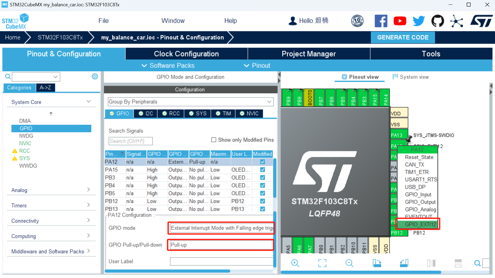

- 打开中断

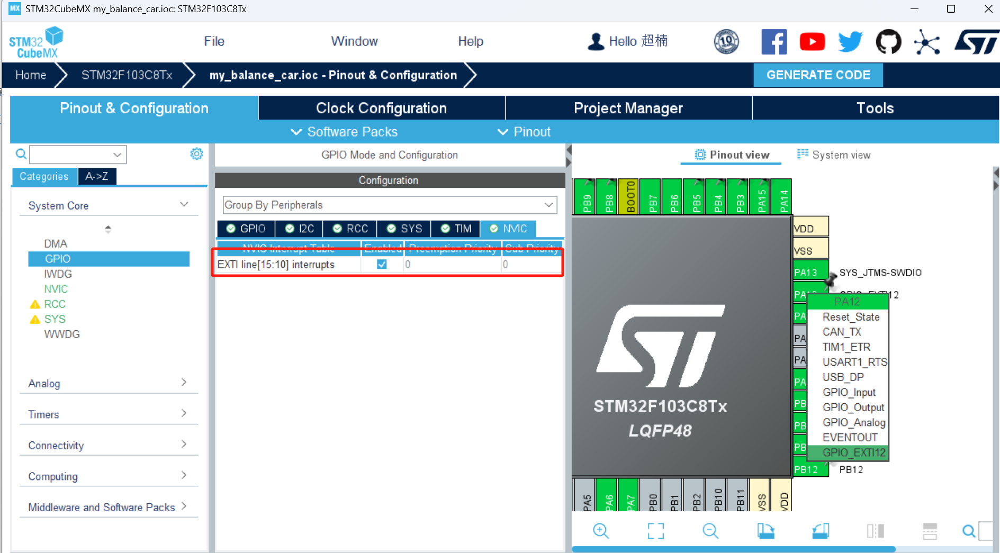

- 创建工程后，在gpio.c当中找到以下函数注释掉。并复制以下函数，粘贴到main.c的“MPU6050_DMP_Init();”下面

```c
HAL_NVIC_SetPriority(EXTI15_10_IRQn, 0, 0);
HAL_NVIC_EnableIRQ(EXTI15_10_IRQn)
```

*(随便找个地方写中断函数，我找的是MPU6050.c里面写中断函数)*

- 在mpu6050.c中先添加头文件

```c
#include "PID.h"
```

- 在mpu6050.c最下面写中断函数

```c
extern float roll;
void HAL_GPIO_EXTI_Callback(uint16_t GPIO_Pin)
{
	if(GPIO_Pin == GPIO_PIN_12)
		if(Turn_Off(roll) == 1)
			Control();
}
```

- 为了更好观察可以修改oled_show函数的内容

```c
extern float roll;
extern short GY;
extern short GX;
extern short GZ;

//显示函数
void OLED_Show(void)
{
    OLED_Refresh_Gram();
	
    OLED_ShowFloat(roll,2,0,0);
		OLED_ShowFloat(GX,2,0,15);

}
```


